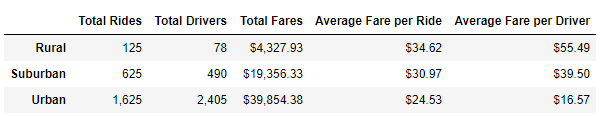
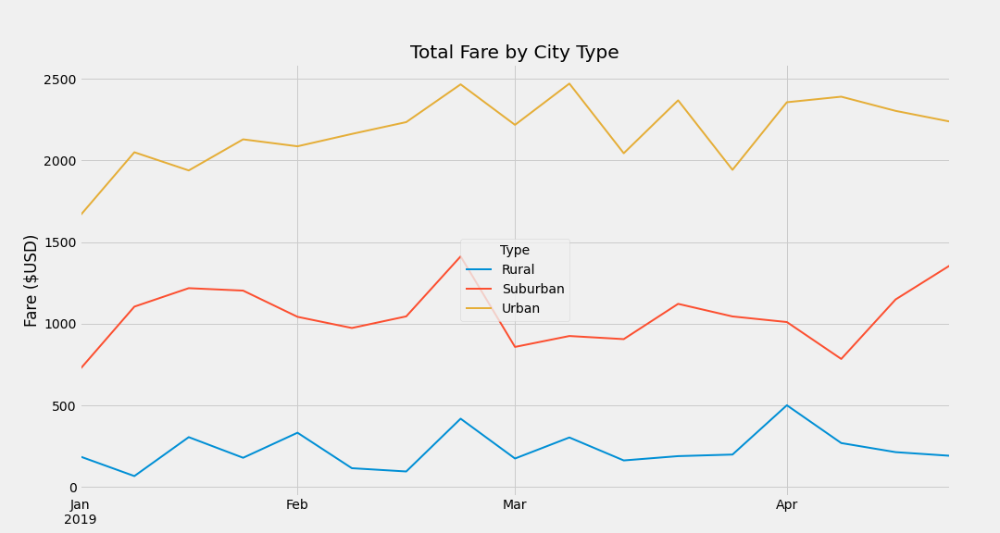

# PyBer_Analysis

## Overview of Analysis

This project is the fifth weekly challenge of the Data Science Bootcamp. It allows us to put into practice and showcare the skills learned in Module 5 of the bootcamp.

### Purpose

Further analysis has been requested on the ride-sharing data.

The information requested is:

- A summary DataFrame of the ride-sharing data by city type.
- A multi-line graph displaying the total weekly fares for each city type.

## Results

Analysis of the input file was carried out in Python 3.7 using  a Jupyter Notebook environment ([PyBer_Challenge.ipynb](PyBer_Challenge.ipynb)) (also viewable at [PyBer_Challenge.ipynb HTML](https://htmlpreview.github.io/?https://github.com/jose-perth/School_District_Analysis/blob/main/PyBer_Challenge.html)).

The input files **city_data.csv** and **ride_data.csv** were provided in CSV format and can be downloaded from the folder [Resources/](Resources/).

### Analysis

#### Deliverable 1: Summary DataFrame

After loading and merging the input files, the following metrics were calculated for each City Type (Urban, Suburban, Rural):

- Total Rides
- Total Drivers
- Total Fares
- Average Fare per Ride
- Average Fare per Driver

The aggregation by City Type was done using the *groupby* function in Python. Here is an example:

```python
fares_by_city_type = pyber_data_df.groupby('type').sum()['fare']
```

Then all metrics were included into a DataFrame and formatted accordingly.

[](Analysis/Ride_data_summary_table.png)

As expected the *Total Rides*, *Total Drivers* and *Total Fares* are highest in the *Urban* group and lowest in the *Rural* group. However, the inverse order is observed when looking at the *Average Fare per Ride* and *Average Fare per Driver*.  Some interesting points can be seen from this:

1. The *Total Rides* in the *Urban* group (1,625) is less than the *Total Drivers* in the same group (2,405) for the time period covered within the analysis. There is a considerably number of drivers that were not active during the period.  This affects the *Average Fare per Driver* significantly.

2. Although the number of rides in the *Rural* group is 1/13th that of the *Urban* cities, the *Average Fare per Ride* is 40% higher in the *Rural* group than in the *Urban* groups.  Further analysis on pricing or average ride distance may be needed to shed further light.

#### Deliverable 2: Multi-line plot of weekly fares

Manipulating the dataframe with the merged input data, we were able to aggregate the total fare per week for each city type.

Some of the manipulation involved grouping the data by *city type* and *date*, then pivoting and aggregating the data by week.

[](Analysis/PyBer_fare_summary.png)

It's important to note that the data included in the chart spans from 2019-01-01 to 2019-04-29 (exclusive) as otherwise only 1 day is included in the week and would not be comparable to the rest of the chart.  This filtering was done by using the following code.

```python
selected_dates_df = pyber_bytype_df.loc['2019-01-01 00:00:00':'2019-04-29 00:00:00']
```

The trends in the chart are as it would be expected based on population sizes for each city type. However, some interesting points can be observed in the chart:

1. The total fare per week for remains fairly consistent for each *City Type* for the entire interval. This metric provides an idea of the level of demand for ridesharing in each of the city groups.

2. There are a couple of spikes that are consistent across two or three groups, both at the end of February and the beginning of April. There could be correlated to region wide events such as public holidays.

## Summary

Based on the results outlined above, the following recommendations have been put forward to address the differences among the city types.

1. Investigate the number of **active** drivers on each city type. It's clear that not all drivers listed for each city have completed a trip in the period of the analysis. This could point to the need for a program to increase the engagement of **non-active** drivers.

2. Investigate the relationship between fares and trip distance.  It could be hypothesized that urban trips tend to be shorter than suburban and rural ones and a metric taking this into consideration, such as fare/mile, may help explain the gap.

3. Implement a program to increase ridership. There is a surplus of drivers in all 3 groups, so a campaign to increase ridership would not be constrained on that respect.

4. As a further step from points 1 and 2 above, evaluate the use of other metrics such as fare per active driver, and fare per mile.